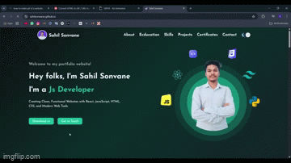

# Sahil Sonvane - Personal Portfolio Website



Welcome to my personal portfolio website showcasing my skills, projects, and certifications as a web developer.

## Features

- Responsive design for all devices
- Dark/Light mode toggle
- Interactive sections:
  - About me
  - Education background
  - Skills with progress indicators
  - Projects showcase
  - Certifications gallery
  - Contact form with email integration
- Animated elements and smooth scrolling

## Technologies Used

- HTML5
- CSS3
- JavaScript
- [Tailwind CSS](https://tailwindcss.com/) (v4.1.3)
- Font Awesome icons
- EmailJS for contact form

## Project Structure

```
sahilsonvane.github.io/
├── index.html          # Main website file
├── script.js           # JavaScript functionality
├── css/
│   ├── styles.css      # Custom CSS
│   └── tailwind.css    # Generated Tailwind CSS
├── images/             # All image assets
├── src/
│   └── input.css       # Tailwind source CSS
├── tailwind.config.js  # Tailwind configuration
└── package.json        # Project dependencies
```
## Link
https://sahilsonvane.github.io/

## How to Use

1. Clone the repository:
   ```bash
   git clone https://github.com/sahilsonvane/sahilsonvane.github.io.git
   ```

2. Open `index.html` in your browser to view the portfolio.

3. For development:
   - Install dependencies:
     ```bash
     npm install
     ```
   - Modify Tailwind styles in `src/input.css`
   - Rebuild Tailwind CSS if needed

## Contact

Feel free to reach out:
- Email: sahilsonvane24@gmail.com
- Phone: +91 7400633774
- LinkedIn: [sahil-sonvane](https://www.linkedin.com/in/sahil-sonvane)
- GitHub: [sahilsonvane](https://github.com/sahilsonvane)

## License

This project is open source and available under the [ISC License](LICENSE).
